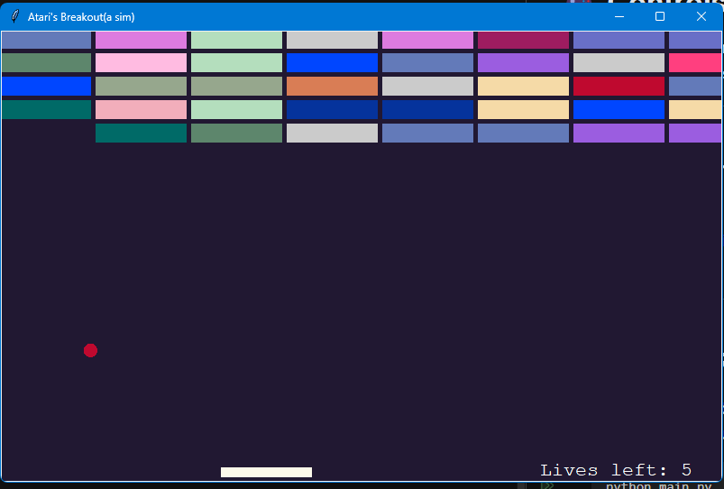

# 🎮 Atari Breakout (Python Turtle Edition)

A recreation of the classic **Atari Breakout** game built using **Python’s Turtle Graphics** module.  
Move your paddle to bounce the ball, break all the bricks, and try not to lose all your lives!

---

## 🚀 Features
- Paddle control via **mouse** or **arrow keys**  
- Dynamic **brick generation**  
- Increasing **ball speed** as you progress  
- Score and lives tracking  
- Game over and victory screens  

---

## 🧠 How It Works
The game runs on a main loop that:
1. Updates ball position and checks for wall collisions  
2. Detects paddle and brick collisions  
3. Updates the score and remaining lives  
4. Ends the game when all bricks are cleared or lives run out  

---

## 🎮 Controls
- **Mouse** → Move the paddle horizontally  
- **← / → Arrow Keys** → Move the paddle left or right  


## 🧩 Requirements
- **Python 3.x**  
- Uses only built-in libraries: `turtle`, `time`, and `random`  

---

## ▶️ How to Run
1. Clone or download this repository.  
2. Run the main file using:
   ```bash
   python main.py
